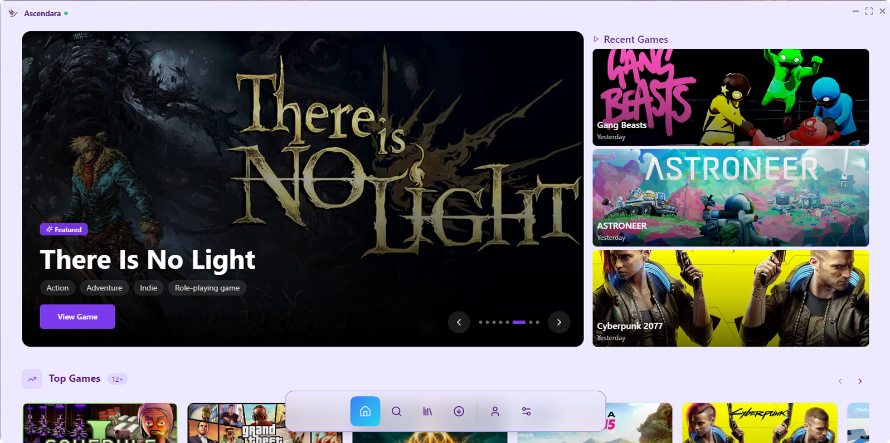
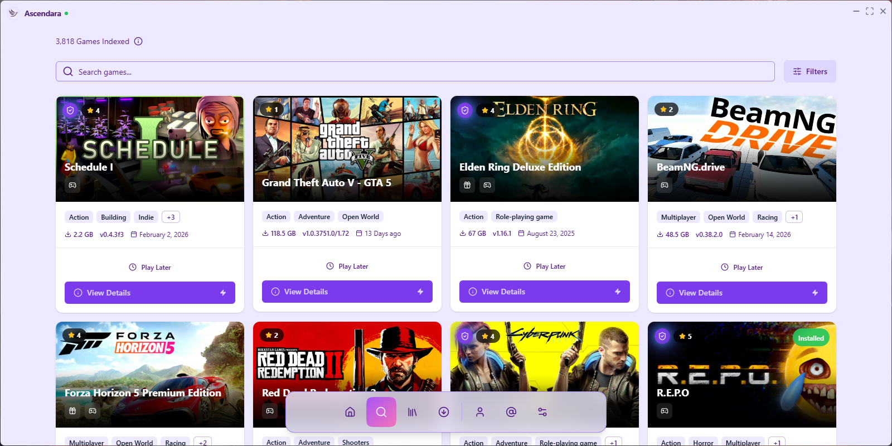
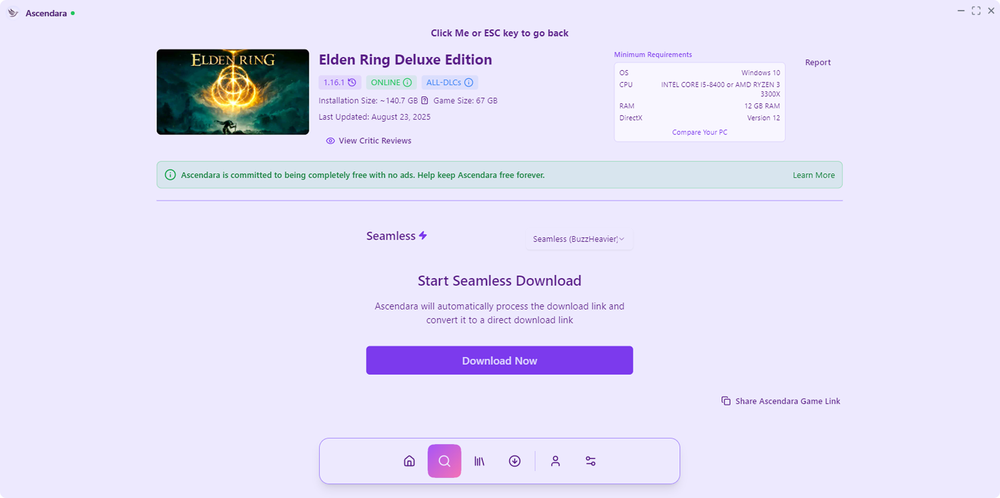
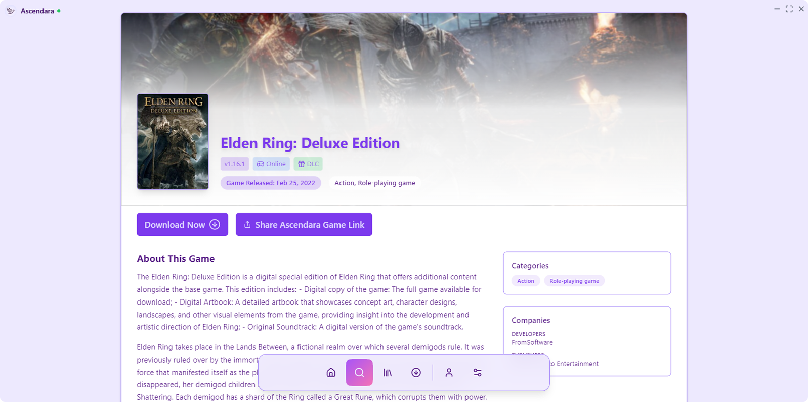
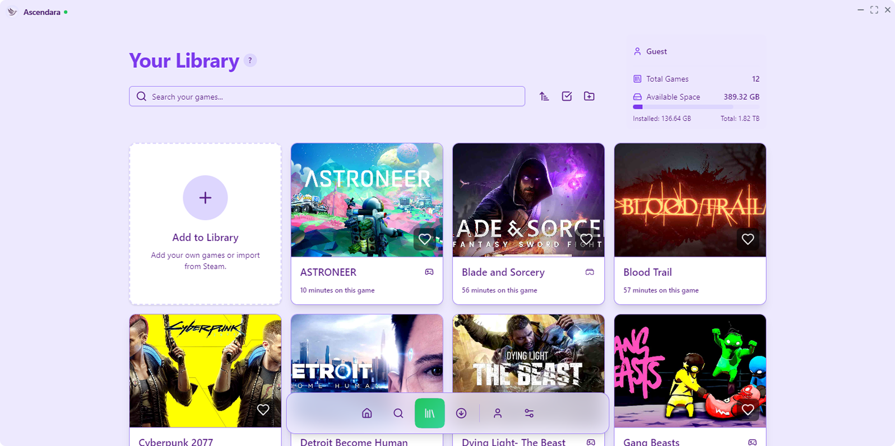
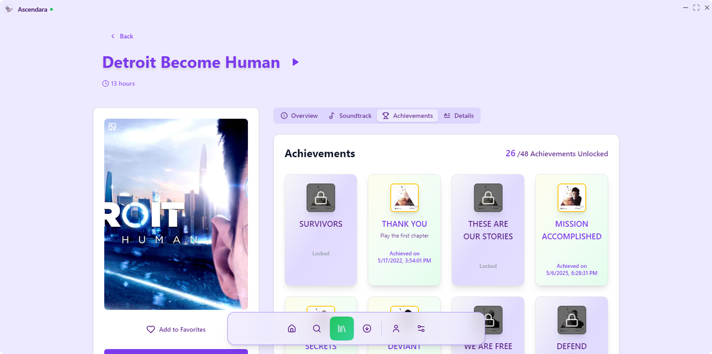
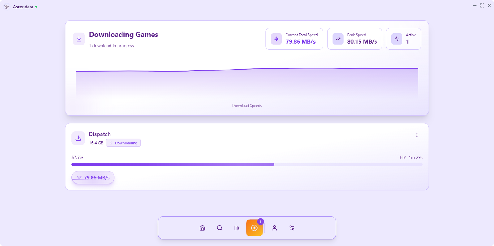
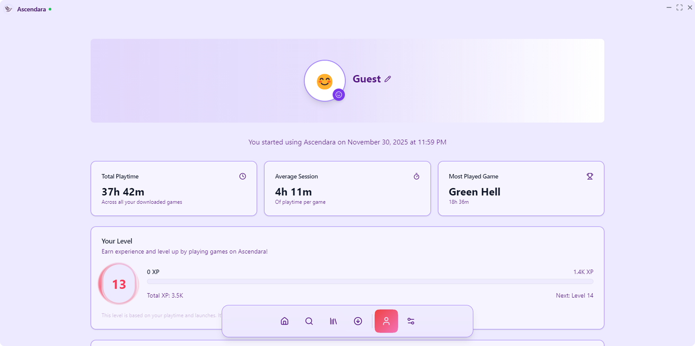

<div align="center">
    
    <h1>Ascendara</h1>
    <p><em>Less setup. More play.</em></p>
    <p>
        <a href="https://discord.gg/ap6W3xMTKW"></a>
        <a href="https://github.com/tagoWorks/ascendara/releases/latest"></a>
         
        <a href="./LICENSE"></a>
    </p>
    <p>
        <a href="https://github.com/tagoWorks/ascendara/issues"></a>
        
        
        <a href="https://github.com/tagoWorks/ascendara/network/members"></a>
        <a href="https://github.com/tagoWorks/ascendara/stargazers"></a>
    </p>
</div>

## 🎮 About

Ascendara simplifies your game management experience by providing a seamless way to discover, organize, and test pre-installed games. No more hassle with extracting, installing, or moving files. The game library is powered by a custom webscraper, currently featuring titles mainly from [STEAMRIP](https://ascendara.app/sources/steamrip) with plans to expand to more sources and is available on both Windows and Linux platforms.

### 🔗 Quick Links

- [Join the Discord](https://ascendara.app/discord) for discussions and support
- [Submit feedback for Ascendara](https://ascendara.app/feedback)
- [Contribute to Ascendara](https://github.com/tagoWorks/ascendara)
- [Read the latest changelog](https://ascendara.app/changelog)
- [Learn about Ascend](https://ascendara.app/ascend)
- [Check latest releases on Github](https://github.com/tagoWorks/ascendara/releases)

## ✨ Features

<table>
  <tr>
    <td width="50%" valign="top">
      <h3>🚀 Seamless Downloads</h3>
      <p>Lightning-fast 2 click downloads for supported games. No browser needed.</p>
    </td>
    <td width="50%" valign="top">
      <h3>☁️ Cloud Backups</h3>
      <p>Keep your game saves backed up securely in the cloud with Ascend.</p>
    </td>
  </tr>

  <tr>
    <td width="50%" valign="top">
      <h3>🔌 Game Information</h3>
      <p>View game details, artwork, story information, soundtrack info, and more.</p>
    </td>
    <td width="50%" valign="top">
      <h3>🌐 Browser Integration</h3>
      <p>Send supported game downloads directly to Ascendara from your browser.</p>
    </td>
  </tr>

  <tr>
    <td width="50%" valign="top">
      <h3>🎨 Theme Customization</h3>
      <p>Customize Ascendara with different themes and visual styles.</p>
    </td>
    <td width="50%" valign="top">
      <h3>🕑 Local Indexing</h3>
      <p>Search through supported games quickly using Ascendara's local index.</p>
    </td>
  </tr>

  <tr>
    <td width="50%" valign="top">
      <h3>📱 Encrypted Remote Access</h3>
      <p>Check download progress remotely with end-to-end encrypted communication.</p>
    </td>
    <td width="50%" valign="top">
      <h3>🕹️ Big Picture Mode</h3>
      <p>Browse your library and launch games with a controller-friendly interface made for the couch.</p>
    </td>
  </tr>

  <tr>
    <td width="50%" valign="top">
      <h3>💾 Ascendara Retro</h3>
      <p>Keep your older console games in their own library with artwork, setup memory, and easy launching.</p>
    </td>
    <td width="50%" valign="top">
      <h3>🌍 105 Language Support</h3>
      <p>Use Ascendara in a wide range of languages from around the world.</p>
    </td>
  </tr>
</table>

<details>
<summary>See the 12 base languages</summary>

These languages come with the app by default:

- English
- Spanish
- French
- German
- Italian
- Chinese
- Arabic
- Hindi
- Bengali
- Portuguese
- Russian
- Japanese

<details>
<summary>Want to see the full list?</summary>

- Afrikaans
- Albanian
- Amharic
- Armenian
- Azerbaijani
- Basque
- Belarusian
- Bulgarian
- Bosnian
- Catalan
- Cebuano
- Chichewa
- Chinese (Traditional)
- Corsican
- Croatian
- Czech
- Danish
- Dutch
- Esperanto
- Estonian
- Filipino
- Finnish
- Frisian
- Galician
- Georgian
- Greek
- Gujarati
- Hausa
- Hawaiian
- Hebrew
- Hmong
- Hungarian
- Icelandic
- Igbo
- Indonesian
- Irish
- Javanese
- Kannada
- Kazakh
- Khmer
- Korean
- Kurdish
- Kyrgyz
- Lao
- Latin
- Latvian
- Lithuanian
- Luxembourgish
- Macedonian
- Malagasy
- Malay
- Malayalam
- Maltese
- Maori
- Marathi
- Mongolian
- Myanmar (Burmese)
- Nepali
- Norwegian
- Pashto
- Persian
- Polish
- Punjabi
- Romanian
- Samoan
- Scottish Gaelic
- Serbian
- Sesotho
- Shona
- Sindhi
- Sinhala
- Slovak
- Slovenian
- Somali
- Sundanese
- Swedish
- Swahili
- Tajik
- Tamil
- Telugu
- Thai
- Turkish
- Ukrainian
- Urdu
- Uzbek
- Vietnamese
- Welsh
- Xhosa
- Yiddish
- Yoruba
- Zulu

</details>

</details>

## 🖼️ Preview App Pages

<details>
<summary>Dropdown all pages</summary>
<div style="display: flex; flex-wrap: wrap; justify-content: center;">
  <div style="margin: 1%; width: 24%;">
    <h3 style="text-align: center;">Home Page</h3>
    
  </div>
  <div style="margin: 1%; width: 24%;">
    <h3 style="text-align: center;">Search Page</h3>
    
  </div>
  <div style="margin: 1%; width: 24%;">
    <h3 style="text-align: center;">Download Game</h3>
    
  </div>
  <div style="margin: 1%; width: 24%;">
    <h3 style="text-align: center;">Game Metadata</h3>
    
  </div>
  <div style="margin: 1%; width: 24%;">
    <h3 style="text-align: center;">Library</h3>
    
  </div>
  <div style="margin: 1%; width: 24%;">
    <h3 style="text-align: center;">Play Game</h3>
    
  </div>
  <div style="margin: 1%; width: 24%;">
    <h3 style="text-align: center;">Downloads</h3>
    
  </div>
  <div style="margin: 1%; width: 24%;">
    <h3 style="text-align: center;">Profile</h3>
    
  </div>
</div>
</details>

## 📦 Install Ascendara

Ascendara is available for both **Windows** and **Linux**.

The installer always downloads the latest version. Older versions can be found on the [GitHub Releases](https://github.com/Ascendara/ascendara/releases) page.

The installer is also open source and available [here](https://github.com/Ascendara/installer).

### Windows

[**Download Ascendara for Windows**](https://cdn.ascendara.app/files/AscendaraInstaller.exe)

### Linux

Run:

```bash
curl -fsSL https://ascendara.app/install.sh | bash
```

## 🤝 Contributing

Contributing to Ascendara is the best way to get your desired features, bug fixes, or improvements into the official build! When your contribution is accepted, your changes will be prominently featured in the Ascendara changelogs, giving you recognition for your valuable input to the project. Learn how to contribute to Ascendara [here](https://ascendara.app/docs/getting-started/contributing).

## 📂 Project Structure

The Ascendara project is organized into the following main directories:

### **src/** - Core application logic and UI implementation

- **components/** - Reusable React components for the UI
  - **ui/** - shadcn/ui component library for modern UI elements
- **context/** - React context providers for global state management (authentication, language, settings, themes, tour)
- **hooks/** - Custom React hooks for efficient image loading and caching
- **lib/** - Utility libraries and helper functions
- **pages/** - Main application pages and screens (Home, Library, Downloads, Settings, etc.)
- **public/** - Static assets and public resources
  - **sounds/** - UI sound effects
  - **guide/** - User guide assets
- **services/** - Service modules for external APIs and core functionality (Firebase, game info, downloads, analytics, integrations)
- **styles/** - CSS styling files for animations, menu bar, and scrollbars
- **translations/** - Internationalization files for 12 base languages (English, Spanish, French, German, Italian, Chinese, Arabic, Hindi, Bengali, Portuguese, Russian, Japanese)

### **binaries/** - Prebuilt Python binaries for core functionality

- **AscendaraAchievementWatcher/** - Tracks and monitors game achievements
- **AscendaraCrashReporter/** - Automated crash reporting and diagnostics
- **AscendaraDownloader/** - Multi-threaded game download manager supporting various file hosts
- **AscendaraGameHandler/** - Game execution, process management, and runtime monitoring
- **AscendaraLocalRefresh/** - Local game index refresh and update tool
- **AscendaraNotificationHelper/** - System notification helper for download events

  > ℹ️ **INFO:** The tools below are additional tools that do not come with the official build of Ascendara. Instead, they utilize Ascendara's tool installation feature to install these supplementary tools as needed.

- **AscendaraLanguageTranslation/** - Translation tool used to translate to the additional 93 languages
- **AscendaraTorrentHandler/** - Torrent download functionality

### **electron/** - Electron main process and IPC communication

- **modules/** - Modular IPC handlers and backend logic (configuration, Discord RPC, downloads, games, settings, system utilities, updates, window management, and more)

### **scripts/** - Development and build automation scripts for Windows/Linux builds, translation checking, and code statistics

## 🛠️ Running from Source

For detailed instructions, check out the [Developer Docs](https://ascendara.app/docs/developer/build-from-source).

### Prerequisites

Before building, ensure you have all required dependencies. [View full requirements](https://ascendara.app/docs/developer/build-from-source#prerequisites).

### Quick Start

> ⚠️ **WARNING:** Some API features like reporting and analytics services will not work on the public version of the app. Additionally, you will not be able to run games in development mode. Check the [Developer Docs](https://ascendara.app/docs/developer/build-from-source#important-limitations) for more information.

1. **Clone the Repository**

   ```sh
   git clone https://github.com/ascendara/ascendara.git
   ```

2. **Install Node Dependencies**

> **Note:** You can use any package manager you prefer, such as npm, yarn, or pnpm.

Using npm:

```sh
npm install
```

Or using yarn:

```sh
yarn
```

3. **Configure Firebase (Optional)**

   Firebase is optional for development. If you have Firebase credentials, create a `.env` file:

   ```sh
   cp .env.example .env
   ```

   Then edit `.env` and replace the placeholder values with your actual Firebase project credentials from the [Firebase Console](https://console.firebase.google.com/).

   > **Note:** Firebase will automatically initialize if credentials are detected. Leave the Firebase fields empty in `.env` to run in development mode without authentication features. The `.env` file is gitignored and will not be committed to the repository.

4. **Install Python Dependencies**

   ```sh
   pip install -r requirements.txt
   ```

5. **Run the Development App**

   Using npm:

   ```sh
   npm run start
   ```

   Or using yarn:

   ```sh
   yarn start
   ```

To build the source code into an executable, read the [Developer Docs](https://ascendara.app/docs/developer/build-from-source).

## 🗺️ Development Roadmap

Ascendara's development roadmap can be found [here](https://ascendara.app/roadmap).

## 📝 License & Contact

Licensed under [MIT](./LICENSE) - 2026 tagoWorks

### Get in Touch

- Email: [santiago@tago.works](mailto:santiago@tago.works)
- Website: [tago.works](https://tago.works)
- Discord: [Join the community](https://ascendara.app/discord)

---

<div align="center">
    <sub>Built with ❤️ by <a href="https://tago.works">tago</a></sub>
</div>
